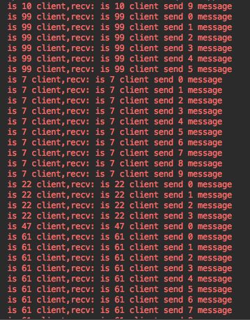
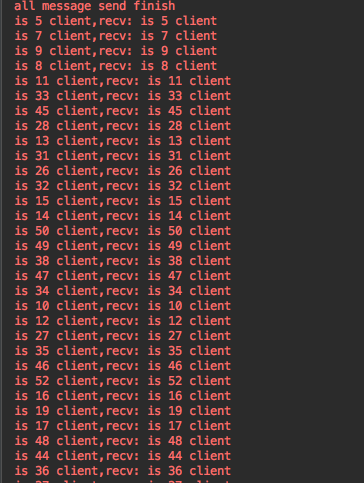

# go_websocket
go websocket demo, added heartbeat

golang搭建的websocket服务器，目前能够提供心跳(在文件"wSConfig.go"里面配置),使用ip+network类型+conn的内存地址和conn进行映射，保存conn的准确。

一个websocket链接发送多条消息情况

一个websocket链接发送多条消息情况

有任何疑问或建议. 欢迎在github或微博里issue我. 
微博:[@TonyReet](http://weibo.com/u/3648931023)

